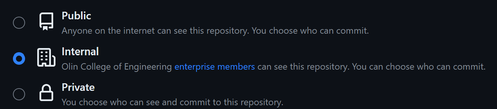

# 📚 Introduction

In this notebook you will:

-   Install & Setup Github 🐙 on either Windows 🟦 or Ubuntu 🪼

-   Become familiar with the Github 🐙 integration in your Rstudio environment

-   Branch off of a directory 🌳, make a branch 🌿, merge the branch with main 💥

Why should I use Github?

-   Github is a free online repository that allows you to easily store and share your code

-   It saves every change you make between your files (as long as you `commit` and `push`), so you can always roll back a change

-   You can easily control access permissions so that you can widely collaborate on a project

-   If you ever publish research or work at a private company, they will often expect a copy of your methods and code. Reproducibility is an under appreciated skill.

# 🟦 Git Setup on Windows

Have you Github username & password ready for this section!

1.  Github uses the open source Git software to function. To start, install the Git software for windows: <https://git-scm.com/download/win>

2.  To use Github in the command line, we need to install Github for command line: <https://cli.github.com/>

3.  Open your `Terminal` application and run this command:

    ```         
    gh auth login
    ```

4.  Follow the prompts to log into your Github account

# 🪼 Git Setup on Ubuntu

Have you Github username & password ready for this section! Note that if you have not `sudo apt update` in a while then it may take a very long time so you can skip it.

1.  Open your `Terminal` application and run this command:

    ```         
    sudo apt update
    sudo apt install gh
    ```

2.  Now run this command in your `Terminal` to initiate the authentication process:

    ```         
    gh auth login
    ```

3.  Follow the prompts to log into your Github account

# 🐙 Github in Rstudio

# 🌳 Going out on a Limb

If you have not already, please go to your group for the final project. We will be making a Github `repository` to store your code. ***Read this part very carefully with your team so you do it properly!***

## 🌱 [For one person] go to <https://github.com/olincollege>

This should be a person that has been added to the Olin college organization and that has permission to create a repository (if no one on your team has this, please reach out to a teaching team member).

### Click the new repository button


### Decide with your group a fitting name for your repo

Titles should be in all lowercase, with words separated by hyphens. For example, if I was making a repository on my analysis of whale sounds 🐋, I could title it `whale-sounds` or `whale-sounds-analysis`.


Feel free to add a description, but you can always come back and do so later!

### Make sure you repository is set to either internal or public

This can be changed later as well, but make sure your repository is at least set to `internal`. This will allow anyone in Olin college to view and collaborate on your code. If you ever want to share what you did with companies later on or add it to your portfolio, you should change it to public.



### Make sure the `Add a README file` is selected

This markdown file will be your guide and advertisement to the world of what your code does! We will also use it later in the assignment to make sure all of you have your Github properly configured.


### Add a .gitignore file

The git ignore file tells github what files to track for saving versus the ones you probably don't want it looking for. We are coding in R so we specifically want to select the standard git ignore file for `R`.


### License

Lastly, it is advisable to choose a license. This tells others under what terms they are allowed to use or reproduce your code. I personally recommend the `MIT License` but this isn't required.


### Create repository

Now you are good to create your repository!

## 🌿 [For Everyone] time to branch!

Now that everyone has setup Github on their computer and that a repository has been created for your project, each team member will make a local `clone` of the repository and then create a branch 🌿. You will each edit the README 📝 to add what your learning goal is for the project and then `commit` and then `push` your changes before ultimately merging 💥 them into the main branch.
