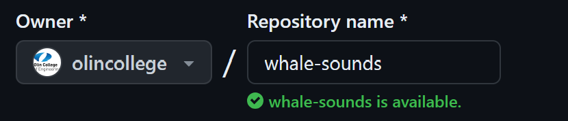
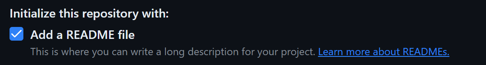
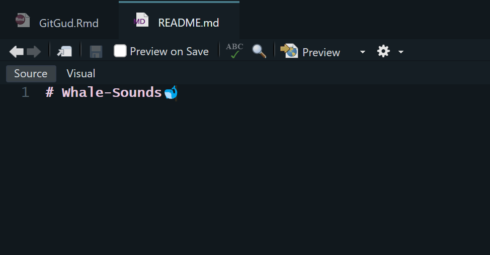
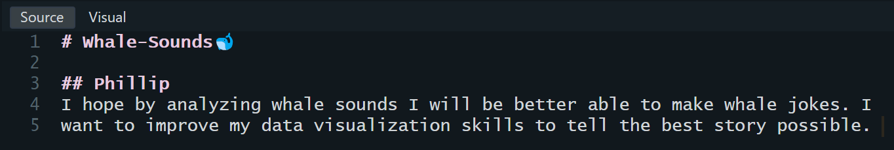
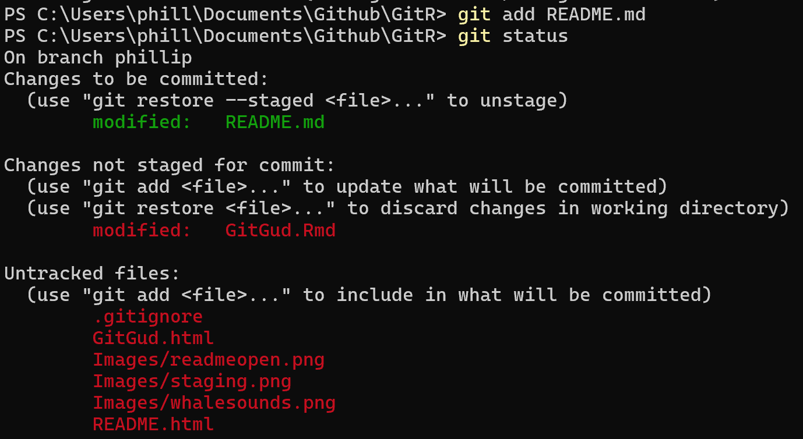
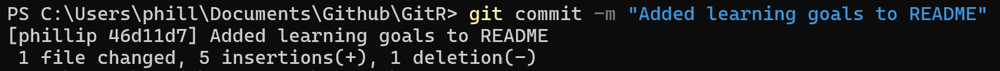
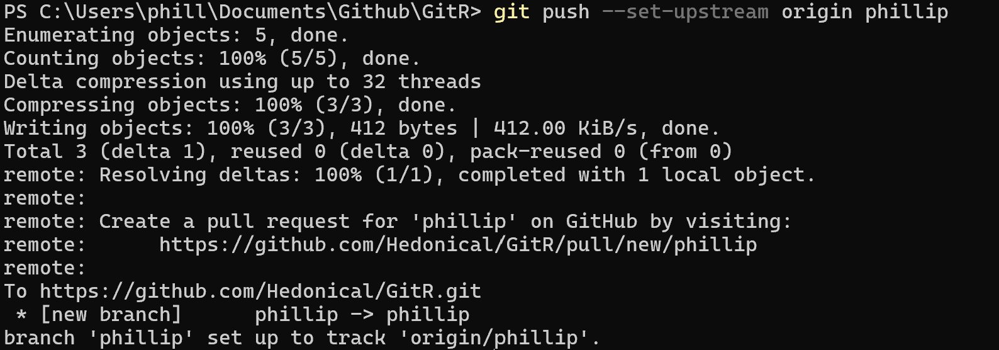
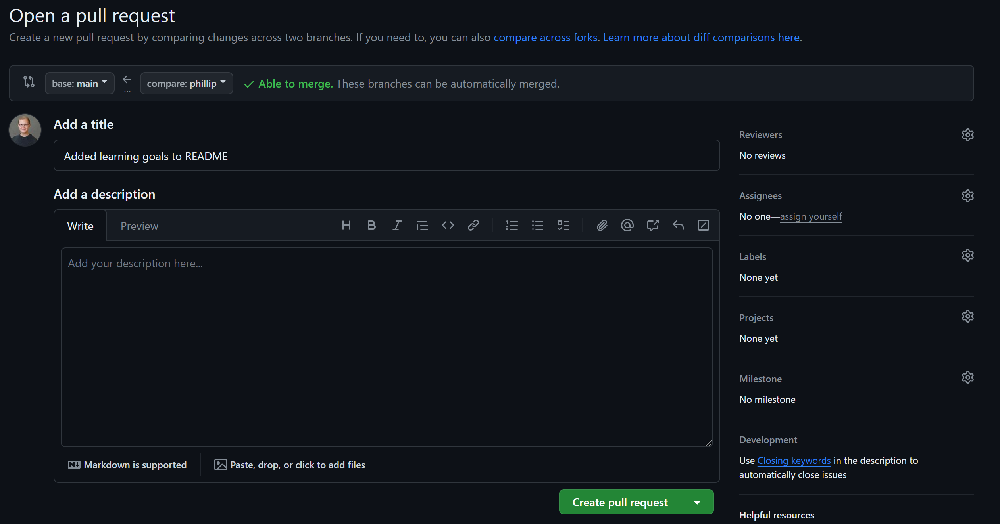
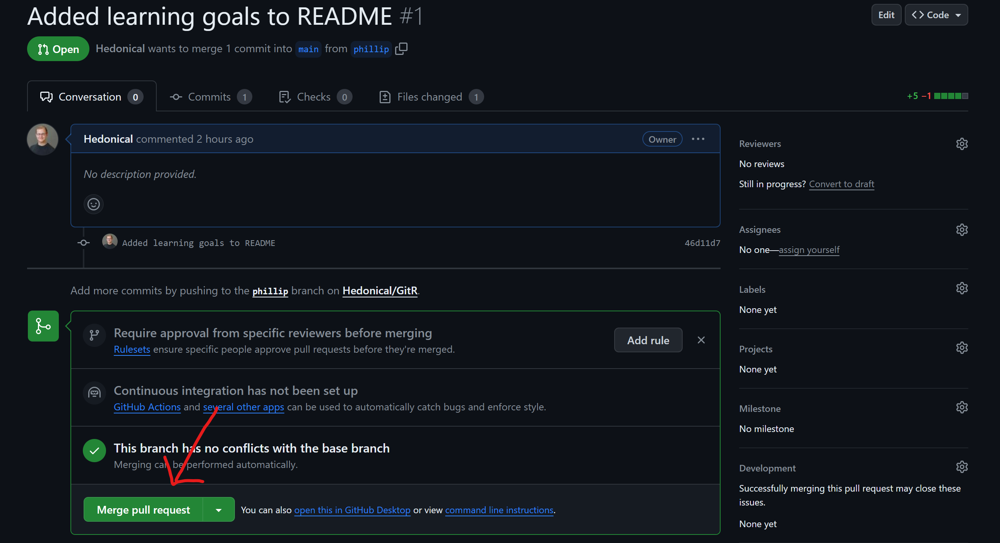
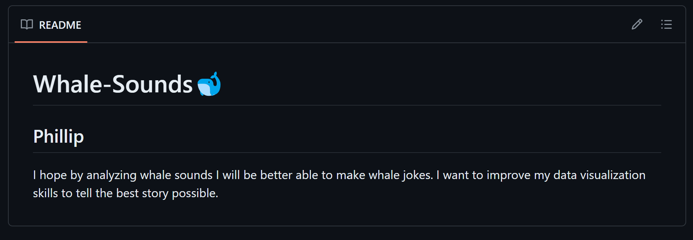

# 📚 Introduction

In this notebook you will:

-   Install & Setup Github 🐙 on either Windows 🟦 or Ubuntu 🪼

-   Become familiar with the Github 🐙 integration in your Rstudio environment

-   Branch off of a directory 🌳, make a branch 🌿, merge the branch with main 💥

Why should I use Github?

-   Github is a free online repository that allows you to easily store and share your code

-   It saves every change you make between your files (as long as you `commit` and `push`), so you can always roll back a change

-   You can easily control access permissions so that you can widely collaborate on a project

-   If you ever publish research or work at a private company, they will often expect a copy of your methods and code. Reproducibility is an under appreciated skill.

# 🟦 Git Setup on Windows

Have you Github username & password ready for this section!

1.  Github uses the open source Git software to function. To start, install the Git software for windows: <https://git-scm.com/download/win>

2.  To use Github in the command line, we need to install Github for command line: <https://cli.github.com/>

3.  Open your `Terminal` application and run this command:

    ```         
    gh auth login
    ```

4.  Follow the prompts to log into your Github account

# 🪼 Git Setup on Ubuntu

Have you Github username & password ready for this section! Note that if you have not `sudo apt update` in a while then it may take a very long time so you can skip it.

1.  Open your `Terminal` application and run this command:

    ```         
    sudo apt update
    sudo apt install gh
    ```

2.  Now run this command in your `Terminal` to initiate the authentication process:

    ```         
    gh auth login
    ```

3.  Follow the prompts to log into your Github account

# 🐙 Github in Rstudio

# 🌳 Going out on a Limb

If you have not already, please go to your group for the final project. We will be making a Github `repository` to store your code. ***Read this part very carefully with your team so you do it properly!***

## 🌱 [For one person] go to <https://github.com/olincollege>

This should be a person that has been added to the Olin college organization and that has permission to create a repository (if no one on your team has this, please reach out to a teaching team member).

### Click the new repository button


### Decide with your group a fitting name for your repo

Titles should be in all lowercase, with words separated by hyphens. For example, if I was making a repository on my analysis of whale sounds 🐋, I could title it `whale-sounds` or `whale-sounds-analysis`.



Feel free to add a description, but you can always come back and do so later!

### Make sure you repository is set to either internal or public

This can be changed later as well, but make sure your repository is at least set to `internal`. This will allow anyone in Olin college to view and collaborate on your code. If you ever want to share what you did with companies later on or add it to your portfolio, you should change it to public.


### Make sure the `Add a README file` is selected

This markdown file will be your guide and advertisement to the world of what your code does! We will also use it later in the assignment to make sure all of you have your Github properly configured.



### Add a .gitignore file

The git ignore file tells github what files to track for saving versus the ones you probably don't want it looking for. We are coding in R so we specifically want to select the standard git ignore file for `R`.


### License

Lastly, it is advisable to choose a license. This tells others under what terms they are allowed to use or reproduce your code. I personally recommend the `MIT License` but this isn't required.


### Create repository

Now you are good to create your repository!

### Make everyone in your team a collaborator

Before everyone can clone and edit the repository to their computer, they need the proper permissions. The person who created the repository should go to the repo home page and click ⚙️`settings`. From there, click collaborators on the left menu and then add everyone in your team.


## 🌿 [For Everyone] time to branch!

Now that everyone has setup Github on their computer and that a repository has been created for your project, each team member will make a local `clone` of the repository and then create a branch 🌿. You will each edit the README 📝 to add what your learning goal is for the project and then `commit` and then `push` your changes before ultimately merging 💥 them into the main branch.

### Go to the homepage of your repository

To start, your only file will probably be your README markdown file.


### Click on the bright green `<> Code` button

Select either the link under `HTTPS` or `SSH` and copy it to your clipboard.

{width="500"}

### Time to clone 🐑

Open your `terminal` and go to a directory where you want to clone your repository. Type in the following command:

```         
git clone LINK
```

with LINK replaced with the link you copied.


You now have a copy of the `main` branch in your folder.

### Make a branch 🌿

A branch is a copy of your main Github repo, commonly made when you have multiple people working on a project or want to isolate some code. Although working purely on the main branch is very common, this is not recommended for many reasons. First and foremost is that it can lead to major merging errors when everyone tries to push their changes to the same place, especially if the main branch has changed since you have last pulled. Therefore, we will make a branch to avoid this!

In your terminal, to make a branch, go to your local copy of the Github repository and type this command (replace phillip with your preferred name)

```         
git checkout -b phillip
```

You can name a branch whatever you wish, but in this case, names are really useful for keeping track of whose branch is which. To confirm the new branch was made, type:

```         
git branch
```

And you should see something like this:


### Edit the README

If you have had Rstudio open, I would recommend closing it just so it knows you are opening a file in a new branch. Open the README.md file in Rstudio. You should see something like this:



Under the title, add a secondary header with your name (ex. `## Phillip`) and under that type your learning goals for this project (1 word minimum).



Now, make sure to save your README.md `CTRL + S` and then go back to your terminal.

### Stage your changes! 🏁🏎️💨

When we choose what changed files to send to Github, this is called `staging`. With the terminal open in the file path of your local Github repo, type:

```         
git status
```

You should see something akin to this:


First, notice that it says `On branch phillip` instead of `On branch main` this is because I am now working in my local branch and will be pushing any edits to this branch. Anything in red is unstaged, to stage our README.md for pushing we need to type:

```         
git add README.md
```

If you type `git status` again in your terminal, you should see README.md now in green.



### Commit your changes! 🕺💃

Now that our changes to the README.md are staged, we want to commit them with a message that will appear in Github. Note that this message will be online for eternity so its important to avoid profanity, slang, or social security numbers. Further your message should be short and concise to what the changes you are committing are doing. For example, my commit may look like:

```         
git commit -m "Added learning goals to README"
```

The `-m` flag tells Github you want to add a message and anything the proceeding quotes are the message.



### Push your changes! 🧱👊

Now we will finish off the process by pushing! This is the command that actually uploads our changes and commit message to Github. Type this in your terminal:

```         
git push
```

But wait!!!! We received an error message. Gasp! Have I betrayed you? Was this entire assignment an elaborate ploy to make a fool out of you that I have been preparing for years in order to slowly usurp the power structure at Olin and become a hereditary ruler? Unfortunately, no. Our push failed because we are pushing a branch we created locally but Github does not know of yet! Thankfully, Git is smart and tells us exactly what to do, simply copy the command Git gives you in the terminal and try to push again.

```         
git push --set-upstream origin yourbranchname
```

You should see something like this:



But we aren't done yet!

### Time to approve those changes 💅

Again, Git is really handy. It knows that since we just pushed a change to a branch, we may want to integrate those changes into our main branch. For that it gave us a link to go to a pull request, open that link in your browser.

**NOTE: avoid approving pull requests at the exact same time as your teammate (this can overwhelm or confuse Github), coordinate with your team to do a pull request one at a time**

When you open the link you should see a screen like this:



Draw your attention to the top left, you want to make sure that it says something along the lines of `base: main <- compare: yourbranchname`. This means we are merging our branches changes into main. If it says this, go ahead and click that `Create pull request` button.

Since the changes we are making are relatively minor, and as long as your not making a pull request simultaneously, go ahead and approve the pull request.



If your merge was successful, go to the homepage of your branch and you should see your goals in the README.



Congrats, you are a Github pro 💅
